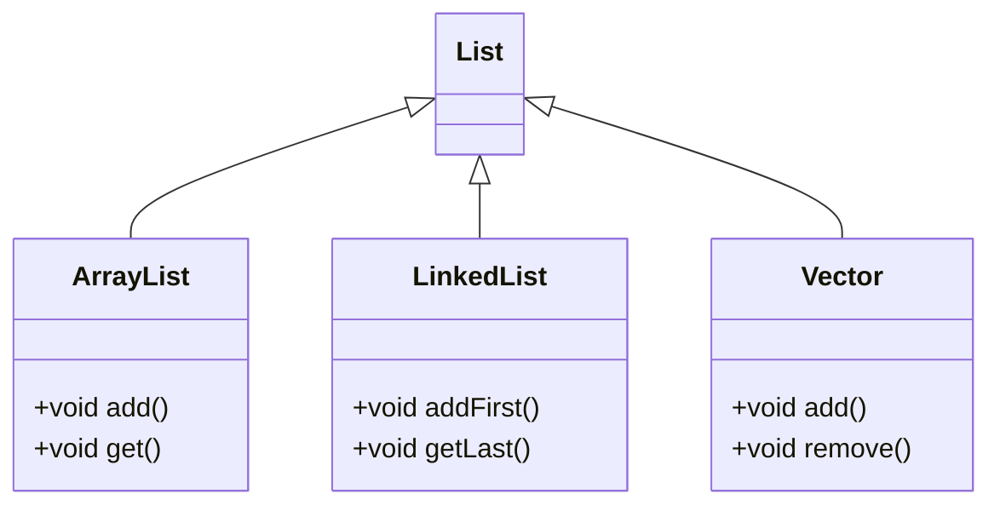

# java-dsa-guide
Comprehensive guide to Java basics, data structures, and algorithms for quick revision and interview preparation. Perfect for mastering coding challenges and technical interviews.


## Table of Contents

1. [Java Basics](#java-basics)
    - [Syntax and Variables](#syntax-and-variables)
    - [Data Types](#data-types)
    - [Control Structures](#control-structures)
    - [Methods and Imports](#methods-and-imports)
2. [Basic Data Structures](#basic-data-structures)
    - [Arrays](#arrays)
    - [Lists (ArrayList and LinkedList)](#lists-arraylist-and-linkedlist)
    - [Sets](#sets)
    - [Maps](#maps)
    - [Vector](#vector)
3. [Advanced Data Structures](#advanced-data-structures)
    - [Stacks](#stacks)
    - [Queues](#queues)
    - [Trees](#trees)
    - [Graphs](#graphs)
    - [Heaps](#heaps)
    - [Hash Tables](#hash-tables)
4. [Common Algorithms](#common-algorithms)
    - [Sorting Algorithms](#sorting-algorithms)
    - [Searching Algorithms](#searching-algorithms)
    - [Dynamic Programming](#dynamic-programming)
    - [Graph Algorithms](#graph-algorithms)
5. [Interview Tips](#interview-tips)

# Java Basics

## Data Types

```java
int integer = 5;                    // int : primitive
double floatNumber = 5.0;            // double : floating-point number
String string = "Hello";             // String : immutable, non-primitive
int[] array = {1, 2, 3};             // Array : fixed size, mutable
List<Integer> listExample = new ArrayList<>(Arrays.asList(1, 2, 3));  // List : mutable, dynamic size
Set<Integer> setExample = new HashSet<>(Arrays.asList(1, 2, 3));      // Set : unordered, unique elements
Map<String, Integer> mapExample = new HashMap<>();                    // Map : key-value pairs
mapExample.put("a", 1);
mapExample.put("b", 2);
```

- **Time Complexity** (common operations):
  - **List (ArrayList)**: Add: O(1) (amortized), Access: O(1), Remove: O(n)
  - **Set (HashSet)**: Add/Remove/Contains: O(1)
  - **Map (HashMap)**: Put/Get: O(1), Remove: O(1)

## Control Structures

### If-Else Statements

```java
if (x > 0) {  
    // action if x is positive
} else if (x < 0) {  
    // action if x is negative
} else {  
    // action if x is zero
}
```

- **Ternary Operator**:

```java
String result = true ? "val1" : "val2"; 
```

### Loops

```java
// For Loop
for (int i = 0; i < 5; i++) {
    // action
}  // Time complexity: O(n)

for (int i = 4; i >= 0; i--) {
    // action
}  // Time complexity: O(n)
```

- **Enhanced For Loop (foreach)**:

```java
for (int num : arr) {
    // iterate over elements in array
}  // Time complexity: O(n)
```

- **Iterate with index**:

```java
for (int index = 0; index < arr.length; index++) {
    int num = arr[index];
    System.out.println(index + ": " + num);
}  // Time complexity: O(n)
```

- **Single line for loop (List initialization)**:

```java
List<Integer> squaredList = new ArrayList<>();
for (int i = 0; i < 5; i++) {
    squaredList.add(i * i);  // adds squares to the list
}  // Time complexity: O(n)
```

- **Using break and continue**:

```java
for (int i = 0; i < 10; i++) {
    if (i == 5) {
        break;  // exits loop when i is 5
    }
    System.out.println(i);
}  // Time complexity: O(n)

for (int i = 0; i < 10; i++) {
    if (i % 2 == 0) {
        continue;  // skips even numbers
    }
    System.out.println(i);  // prints odd numbers
}  // Time complexity: O(n)
```

- **While Loop**:

```java
int i = 0;
while (i < 5) {
    System.out.println(i);
    i++;
}  // Time complexity: O(n)
```

## Sorting with `Comparator` (Equivalent of attrgetter)

```java
import java.util.Comparator;
import java.util.Collections;

// Sorting objects using Comparator
Collections.sort(students, Comparator.comparing(Student::getGrade)
                                     .thenComparing(Student::getAge)
                                     .reversed());  
// Sort students by grade, then by age in descending order
```

- **Time Complexity**: O(n log n)


### Methods and Imports

- **Methods:**

```java
public int calculateSum(int a, int b) {  // Define a method to calculate sum
    return a + b;
}

// Lambda functions: Small anonymous functions defined with lambda expressions
// Example: (parameters) -> expression
BiFunction<Integer, Integer, Integer> multiply = (x, y) -> x * y;  // Multiplies two numbers
int result = multiply.apply(2, 3);  // result is 6

// Example: Lambda function for quick sorting
List<int[]> arr = new ArrayList<>();
Collections.sort(arr, (a, b) -> Integer.compare(a[1], b[1]));  // Sorts list of arrays based on the second element
```


### Basic Data Structures

#### Arrays

In Java, arrays are a fixed-size, index-based data structure that holds elements of the same type.

- **Initialization:**

```java
// Initialize an array with a fixed size
int[] myArray = new int[5];  // Array of size 5, elements default to 0

// Initialize an array with elements
int[] myArrayWithElements = {1, 2, 3, 4, 5};  // Array initialized with values
```

- **Common Operations:**

```java
// Access elements by index
int firstElement = myArrayWithElements[0];  // O(1)

// Modify an element
myArrayWithElements[1] = 10;  // O(1)

// Iterate over an array
for (int element : myArrayWithElements) {
    System.out.println(element);  // O(n)
}

// Get array length
int length = myArrayWithElements.length;  // O(1)
```

#### Array Pros and Cons:
- **Pros**:
  - Constant-time access via index (O(1)).
  - Low memory overhead since it's a fixed-size structure.
  
- **Cons**:
  - Fixed size; resizing requires creating a new array and copying elements (O(n)).
  - Insertion and deletion (except at the end) are O(n) due to shifting.

---

#### Lists (Java equivalent: `ArrayList` and `LinkedList`)

After arrays, Java offers flexible, dynamic data structures like `ArrayList` and `LinkedList`, which are part of the Java Collections Framework.

- **Java List Interface Hierarchy**:




#### ArrayList (Dynamic Arrays)

`ArrayList` is a resizable array that allows dynamic resizing.

- **Initialization:**

```java
// Initialize an empty ArrayList
List<Integer> arrayList = new ArrayList<>();

// Initialize with elements
List<Integer> arrayListWithElements = new ArrayList<>(Arrays.asList(1, 2, 3, 4, 5));
```

- **Common Operations:**

```java
// Add an element at the end
arrayList.add(6);  // O(1) amortized

// Insert an element at a specific index
arrayList.add(2, 10);  // O(n), due to shifting

// Remove an element
arrayList.remove(Integer.valueOf(10));  // O(n), due to shifting

// Access an element by index
int element = arrayList.get(1);  // O(1)

// Iterate over an ArrayList
for (int element : arrayList) {
    System.out.println(element);  // O(n)
}
```

- **Pros**:
  - Dynamic resizing.
  - Constant-time access (O(1)).

- **Cons**:
  - Insertion/removal at the middle or beginning involves shifting (O(n)).
  - Higher memory usage due to dynamic resizing.

---

#### LinkedList (Doubly Linked List)

`LinkedList` is a doubly linked list that allows fast insertion and deletion at both ends.

- **Initialization:**

```java
// Initialize an empty LinkedList
List<Integer> linkedList = new LinkedList<>();

// Initialize with elements
List<Integer> linkedListWithElements = new LinkedList<>(Arrays.asList(1, 2, 3, 4, 5));
```

- **Common Operations:**

```java
// Add an element at the end
linkedList.add(6);  // O(1)

// Add an element at the start
linkedList.addFirst(0);  // O(1)

// Remove an element
linkedList.remove(Integer.valueOf(3));  // O(n)

// Access an element by index
int element = linkedList.get(2);  // O(n), since traversal is required

// Iterate over a LinkedList
for (int element : linkedList) {
    System.out.println(element);  // O(n)
}
```

- **Pros**:
  - Efficient insertions and deletions at both ends (O(1)).
  - No need for resizing like `ArrayList`.

- **Cons**:
  - O(n) access time for elements.
  - Higher memory usage due to node pointers.

---

#### Vector

`Vector` is similar to `ArrayList` but is synchronized, meaning it's thread-safe.

- **Initialization:**

```java
Vector<Integer> vector = new Vector<>();
```

- **Common Operations:**

```java
// Add an element
vector.add(6);  // O(1)

// Remove an element
vector.remove(Integer.valueOf(2));  // O(n)

// Access an element by index
int element = vector.get(1);  // O(1)
```

- **Pros**:
  - Synchronized (thread-safe).

- **Cons**:
  - Slower due to synchronization.
  - Similar performance characteristics as `ArrayList`.

```


